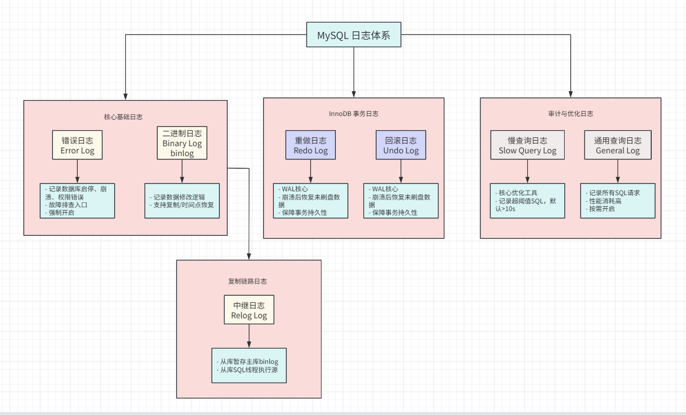

# MySQL日志系统的深入浅出

## 为什么需要MySQL日志系统

不知道大家有没有遇到过这些场景：
- 数据库连接异常，无法访问，不知道怎么排查；
- 数据库性能瓶颈，无法定位；
- 主从复制延迟严重，数据同步失败；
- 数据库崩溃，数据会不会丢失，能否快速恢复；
这时，日志系统就显得尤为重要。它记录了数据库运行全过程的关键信息，可以帮助我们排查问题、定位性能瓶颈、监控主从复制状态，并在数据库崩溃时进行快速恢复。可以说，无论是开发、运维，还是DBA，只要想真正地掌握数据库，都绕不开日志系统。

MySQL的日志系统不只是一个的单一日志，它是一套分工明确、协同工作的日志体系：
- 有记录错误和警告的**错误日志（Error Log）**；
- 有性能优化伴侣的慢**查询日志（Slow Query Log）**；
- 有支撑主从复制，数据恢复的**二进制日志（Binary Log）**；
- 保证事务安全的**重做日志（Redo Log）** 和 **回滚日志（Undo Log）**；

各个类型的日志各司其职，构成了MySQL高可用，高可靠性的基石。

下面就逐一说说各个日志是如何工作的。

## MySQL 主要日志类型

### 1. 错误日志（Error Log）

记录了MySQL服务启动、运行及关闭过程中的产生的错误、警告及部分重要通知信息，可以帮助我们排查系统、权限、资源等问题。
是数据库发生故障时首要排查的地方。
**典型应用场景**

- 数据库无法正常启动时的故障排查
- 数据库初始化时发生权限异常或资源不足导致的故障排查
- 关键生命周期事件问题排查（如主从切换故障，ssl配置错误信息）

**关键配置参数**
- `log-error`：指定错误日志文件的路径和名称，默认在Data目录下的`hostname.log`
- `log_error_verbosity`：指定错误日志的详细程度，MySQL5.7+后默认为2，取值范围为1-3，分别表示不同详细程度的日志信息，1=仅错误，2=错误+警告，3=错误+警告+信息

[error log 官网地址](https://dev.mysql.com/doc/refman/8.0/en/error-log.html)

### 2. 二进制日志（Binary Log，binlog）

记录了系统中数据新增和修改操作的DDL和DML语句，包括了CREATE、ALTER、DROP、TRUNCATE以及INSERT、UPDATE、DELETE等操作。
其设计目标是支持数据复制和数据恢复。
**典型应用场景**

- 主从复制，从库拉去主库的binlog，通过日志重放达到数据同步复制。
- 数据误删误改恢复，可以基于某个时间点的备份，通过重放binlog或反向SQL恢复数据。
- 数据备份和灾难恢复，结合全量备份，可以通过重放binlog来恢复数据到指定时间点。

**关键配置参数**

- `log-bin`：指定二进制日志文件的路径和名称，默认在Data目录下的`hostname-bin.log`
- `binlog_format`：指定二进制日志的格式，有三种格式可选，STATEMENT、ROW、MIXED，默认为ROW
- `expire_logs_days`: 指定二进制日志的过期天数，默认为0，表示永久保存
- `max_binlog_size`：单个binlog文件的最大值，默认为1G，当binlog达到该大小时，会自动创建一个新的binlog文件

[binary log 官网地址](https://dev.mysql.com/doc/refman/8.0/en/binary-log.html)

### 3. 中继日志（Relay Log）

主从复制过程中，从库会把从主数据库拉取的binlog写入自身的relay log中，通过从库的SQL线程执行relay log达到数据同步复制。

**关键配置参数**

- `relay_log`：指定relay log的路径和名称，默认在从库Data目录下的`hostname-relay-bin.log`

[relay log 官网地址](https://dev.mysql.com/doc/refman/8.0/en/replica-logs-relaylog.html)

### 4. 重做日志（Redo Log）

<!-- https://dev.mysql.com/doc/refman/8.0/en/innodb-parameters.html#sysvar_innodb_rollback_segments -->
是InnoDB 存储引擎的事务日志，记录了事务操作修改数据页的**物理变更**，而非SQL语句本身。
保证事务的持久性，确保在系统崩溃后可以通过redo log恢复已经提交的事务
实现WAL（Write-Ahead Logging），顺序写替代随机写，提供写入性能。

**典型应用场景**

- 崩溃恢复，通过redo log恢复已经提交但未写入数据文件的事务，确保了数据不丢失。
- 性能加速器，将事务提交的强制刷盘从随机写优化为顺序写，提高了写入性能。
- 与binlog结合，实现数据备份和灾难恢复，提供高可用性。

**关键配置参数**

- `innodb_log_files_in_group`：指定redo log文件组的数量，默认为2
- `innodb_log_file_size`：指定redo log文件的大小，默认为48M
- `innodb_redo_log_capacity`：MySQL8.0.30及以后版本，指定redo log缓冲区的大小，默认为1G，如果定义了这个值，`innodb_log_files_in_group`和`innodb_log_file_size`两者都被忽略。
- `innodb_log_buffer_size`：指定redo log缓冲区的大小，默认为16M
- `innodb_flush_log_at_trx_commit`：指定事务提交时flush log的次数，默认为1，安全性最高，取值范围为0-2，0=性能最高，1=默认值，2=性能和安全性折中

[redo log 官网地址](https://dev.mysql.com/doc/refman/8.0/en/innodb-redo-log.html)

### 5. 回滚日志（Undo Log）

是InnoDB 存储引擎的事务日志，记录了事务执行过程中，数据被修改之前的旧版本数据。
当事务执行失败或者回滚时，能够通过undo log恢复到事务执行前的状态。
事务提交后，undo log不会立即删除，需要等待所有可能用到该版本的事务都结束了才会被删除。

**典型应用场景**

- 事务回滚，事务执行失败或者回滚时，通过undo log，将数据恢复到事务执行前的版本。保证事务的原子性。
- MVCC应用，通过undo log形成的版本链，结合Read View，实现多版本并发控制，保证事务的隔离性。

**关键配置参数**

- `innodb_undo_tablespaces`：指定undo log表空间的数量，默认值和最小值都为2；
- `innodb_undo_directory`：指定undo log表空间的目录，没有定义时默认为Data目录；
- `innodb_max_undo_log_size`：指定undo log文件的最大值，默认为1G

[undo log 官网地址](https://dev.mysql.com/doc/refman/8.0/en/innodb-undo-logs.html)

### 6. 慢查询日志（Slow Query Log）

记录了执行时间超过指定阈值的SQL语句。通过分析这些慢SQL，找到性能瓶颈，进行SQL优化和索引优化。

**典型应用场景**

- 定位慢SQL，捕捉执行时间超过指定阈值的SQL语句。
- 结合执行计划，分析慢SQL的执行原因，进行SQL优化和索引优化。
- 结合分析工具，如pt-query-digest，生成周期性性能分析报告。

**关键配置参数**

- `slow_query_log`：指定慢查询日志的开关，默认为OFF，推荐开启；
- `slow_query_log_file`：指定慢查询日志文件的路径和名称，默认在Data目录下的`hostname-slow.log`；
- `long_query_time`：指定慢查询的阈值，默认为10s

[slow query log 官网地址](https://dev.mysql.com/doc/refman/8.0/en/slow-query-log.html)

### 7. 一般查询日志（General Query Log）

记录了数据库所有客户端连接、断开事件信息
记录了所有客户端执行的SQL语句

**典型应用场景**

- 临时调试，可以复制特定用户的操作，分析排查问题；
- 行为审计，根据用户连接、断开信息，执行的SQL语句，进行合规审计；

**关键配置参数**
- `general_log`：指定一般查询日志的开关，默认为OFF，由于会记录所有操作，对I/O性能影响很大，推荐关闭；
- `general_log_file`：指定一般查询日志文件的路径和名称，默认在Data目录下的`hostname.log`；
- `binlog_format`：和binlog是同一个参数，默认为ROW

[The General Query Log 官网地址](https://dev.mysql.com/doc/refman/8.0/en/query-log.html)

## 总结
日志本身不会说话，但深入了解MySQL日志系统，不仅能够提升日常运维能力，还能为我们排查问题和优化性能提供有力支持，更能为数据库的高可用、高可靠性能提供坚实保障。

