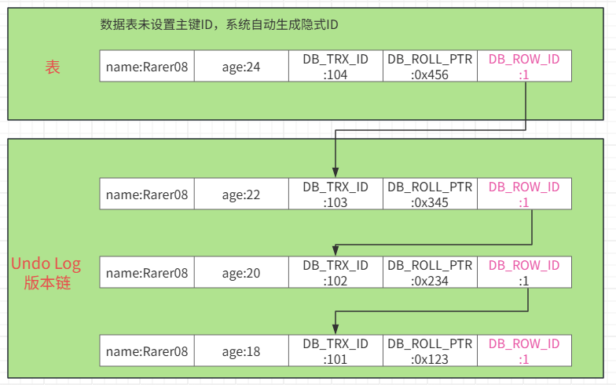

## 什么是MVCC，怎么理解

MVCC，Multi-version Concurrency Control，是一种关于数据多版本并发控制的技术理念。核心思想是为了维护数据的一致性，数据库系统会保存数据的**多个版本**，当一个事务需要读取数据时，数据库系统根据**可见性规则**，最终决定返回哪个版本的数据。这个过程中，无论其他事务怎么修改数据，都不会影响当前事务读取内容的一致性。核心价值是在保证事务隔离型的前提下，最大程度的提供读写并发性能。
MVCC理念广泛应用于关系型数据库系统中，如MySQL、Oracle、PostgreSQL等。
本文主要说明 MySQL MVCC的实现原理。

## MVCC解决了哪些问题
传统数据库并发场景主要有三种，**读-读**，**读-写**，**写-写**。三种场景中，只有读-读场景可以正常的并发执行，不出现问题。其他两种场景下都会出现不同程度的线程安全问题，破坏事务的隔离性机制。要解决这些问题，引入了锁机制，但是引入的锁机制有严重的影响并发性能。
采用MVCC可以解决下面问题
1. 解决读-写冲突，提升并发吞吐量
2. 解决脏读问题
3. 解决不可重复读问题
4. 解决部分幻读问题

## MVCC的具体实现过程
在具体说明MVCC的实现之前，先来解释几个核心组件和概念

**快照读**：
事务开始后，在第一次读取数据时会生成一份数据的快照版本，当事务再次读取数据时，会直接读取快照版本，这样就保证了同一个事务读取数据的一致性。

**当前读**：
事务在每次读取数据时，都会读取已经提交的最新版本数据，并且会对读取的数据加锁，阻塞其他事务对数据的修改。

**隐式字段**: 
- DB_TRX_ID：事务标识符，记录修改该行数据的事务ID，每次事务开始时都会分配一个唯一标识符。
- DB_ROLL_PTR：回滚指针，指向事务开始前的该行记录的历史版本地址，用于事务回滚时恢复数据。
- DB_ROW_ID：一个随新插入行自增的行ID，用于快速定位行数据。当数据表中没有聚簇索引或者一个唯一非空索引作为主键，系统就会自动生成DB_ROW_ID作为主键。

**Undo log**
在事务执行过程中，MySQL系统会将数据修改前的旧版本记录在Undo log中，这些旧的数据版本通过DB_ROLL_PTR指针连接起来，形成一个单向链表的版本链。

 

**Read View**
Read View 是一组活跃事务ID的快照。它包含了下面几个元素。
- m_ids：当前MySQL系统中所有活跃事务的ID列表。
- creator_trx_id：创建当前Read View的事务ID。
- min_trx_id：m_ids中最小的事务ID。
- max_trx_id：系统分配给下一个事务的ID，不在当前m_ids列表中，其值大于m_ids中的事务ID大小。

**MVCC的工作原理**
MVCC的工作过程可以分为两类，**数据修改**和**数据读取**。

**数据修改**：
事务执行过程中，数据发生修改，InnoDB会执行以下操作：
1. 为事务分配一个事务ID（之前没有被分配事务ID）；
2. 将数据行旧版本写入Undo log；
3. 更新数据行，DB_ROLL_PTR指向刚刚生成的Undo log，DB_TRX_ID记录当前事务ID；
4. 如果数据行被删除，系统会先将其标记为“删除”，不会真正的删除，后续当前事务ID不再在活跃事务列表中（m_ids）存在，由purge线程异步清理。

**数据读取**：
事务执行过程中，数据发生读取，InnoDB会执行以下操作：
1. 生成一个Read View,具体生成规则根据隔离级别有所不同；
2. 遍历该行记录的数据页记录和 Undo log，根据Read View 和该行记录当前版本的DB_TRX_ID来判断数据是否可见；
3. 如果数据记录不可见，根据DB_ROLL_PTR指针，读取 Undo log 中的上一个版本数据，再次判断，直到找到一个可见数据记录（如果所有版本都不可见，返回空）。

**可见性判断**
假设数据行的某个版本的DB_TRX_ID值trx_id，根据Read View中的信息，判断该版本在当前事务中是否可见：
1. 若 trx_id 等于 creator_trx_id，该行记录是当前事务修改的，可见；
2. 若 trx_id 小于 m_ids 中的最小事务ID，即小于 min_trx_id，该版本是在当前Read View 生成之前提交的，该版本对当前事务可见；
3. 若 trx_id 大于等于 max_trx_id，该版本是在当前Read View 生成之后提交的，该版本对当前事务不可见；
4. 当 trx_id 大于等于 min_trx_id 且 小于 max_trx_id ，若 trx_id 在 m_ids 列表中，该版本是一个活跃事务的修改，还未提交，后续可能还会修改或回滚，所以对当前事务不可见。若 trx_id 不在m_ids 列表中，说明当前修改记录已经提交，修改已经确定，所以对当前事务可见；

举例说明，假设一张简单的user表，将隐式字段显示出来，初始状态是下面这样的：
| id | name   | age| DB_TRX_ID | DB_ROLL_PTR |
|:---:|:---------:|:----:| :---------: | :-----------: |
| 1 | Rarer08 | 25 |    10     |   null         |

场景：两个事务并发执行
事务A，被分配的DB_TRX_ID为100，负责更新数据;
事务B，被分配的DB_TRX_ID为110，负责读取数据;

事务执行过程

T1: 事务A和事务B都开始，分别分配对应的事务ID。当前系统活跃的事务ID列表[100， 110]。

```bash
START TRANSACTION;
```

T2: 事务A更新数据，
```bash
UPDATE user SET age=26 WHERE id=1;
```
系统将数据行旧版本（即DB_TRX_ID为10的版本）写入Undo log，
更新数据行，DB_ROLL_PTR指向刚刚生成的Undo log，DB_TRX_ID记录当前事务ID；

Undo log中的新增一条记录，
|被指向地址 | id | name   | age| DB_TRX_ID | DB_ROLL_PTR |
|:---:|:---:|:---------:|:----:| :---------: | :-----------: |
|  0x123  | 1 | Rarer08 | 25 |    10     |   null         |

数据行的状态就变为如下显示

| id | name   | age| DB_TRX_ID | DB_ROLL_PTR |
|:---:|:---------:|:----:| :---------: | :-----------: |
| 1 | Rarer08 | 26 |   100     |   0x123         |

DB_ROLL_PTR 0x123 指向Undo log中的旧版本数据。

T3: 事务B读取数据，
```bash
SELECT age FROM user WHERE id=1;
```
系统为事务B生成一个Read View，
- m_ids: [100， 110];
- creator_trx_id: 110;
- min_trx_id: 100;
- max_trx_id: 120

那事务B查询结果的可见性具体怎么判断呢？
根据上面的规则，
先找最新的数据页记录，其DB_TRX_ID值为100，在m_ids = [100, 110]列表中，说明该版本是未提交的活跃事务版本，对当前事务不可见。
在Undo log中寻找上一个版本，其DB_TRX_ID值为10，小于min_trx_id，该版本是在当前Read View 生成之前提交的，该版本对当前事务可见。
返回结果（ age = 25 ），不会读取到事务A未提交数据，避免了**脏读**。

T4: 事务A提交（commit）。

T5：事务B再执行查询
```bash
SELECT age FROM user WHERE id=1;
```
这时如果数据库的隔离级别为**REPEATABLE READ**，事务只在第一次执行快照读时生成Read View，后续的读操作都会复用第一次生成的Read View。
事务B会复用第一次生成的Read View，m_ids = [100, 110]，事务ID = 100的事务还是活跃事务，还是会寻找到上个版本，即DB_TRX_ID值为10的版本。返回结果一致。避免了**不可重复读**。
如果隔离级别为**READ COMMITED**，事务每次在执行快照读时，都会生成一个新的Read View。所以，事务B在查询时会新生成一个Read View：
- m_ids: [110];
- creator_trx_id: 110;
- min_trx_id: 110;
- max_trx_id: 120
根据可见性规则判断：
找最新的数据页记录，其DB_TRX_ID值为100，小于Read View的min_trx_id，该版本是在当前Read View 生成之前提交的，所以对当前事务可见。这就是**读已提交**。查询结果返回（age = 26），查询到最新提交的结果。

## 总结

通过上面的分析，可以得出MVCC实现原理如下：
1. 写入数据时，将旧版本记录在Undo log中，形成一个版本链；
2. 读取数据时，根据Read View和数据行当前版本的DB_TRX_ID来判断数据是否可见；
3. 实现**读不阻塞写，写不阻塞读**
4. 通过Read View生成时机的不同，有区分的实现了**读已提交（READ COMMITTED, RC）**和**可重复读(REPEATABLE READ, RR)**两种隔离级别。解决了**脏读**问题，RR级别下解决**不可重复读**和大部分**幻读**问题场景。RR级别下，事务执行过程有快照读->当前读->快照读，这种转换读的，幻读问题依然有可能存在。


