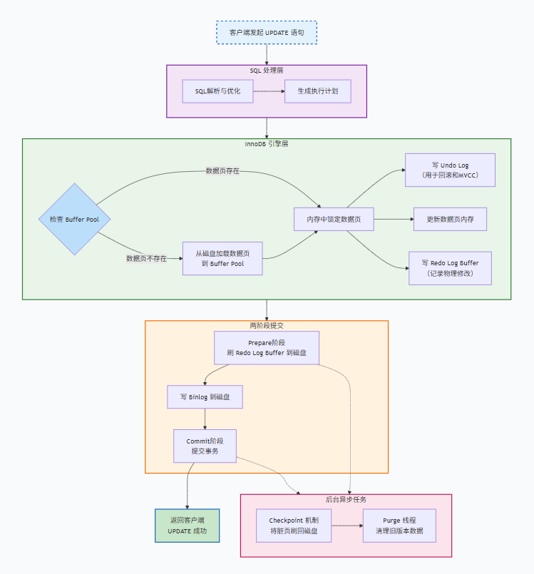

## 记录一次InnoDB update的事务执行过程

最近整理了MySQL索引，事务，MVCC，日志系统等相关知识，想着具体结合某个操作的执行过程来串串。
今天刚好碰见个update操作，就以这个操作为例，记录一下InnoDB的事务执行过程。
这个过程涉及到了多个核心组件，包括Buffer Pool，Undo Log，Redo Log，binlog，以及MVCC等。

为了直观理解，可以将整个流程分为几个核心阶段：



### 第一阶段：客户端请求与SQL解析

**1. 客户端发起UPDATE语句**

应用程序向MySQL服务器发送UPDATE语句。
```bash
START TRANSACTION;
UPDATE users SET name = '张三' WHERE id = 1;
```
显式执行 BEGIN 或者 START TRANSACTION，开启一个事务。

**2. SQL解析与优化**

服务器分析层进行语法解析，优化器选择最优的执行计划，执行器开始执行更新操作。

### 第二阶段：InnoDB事务执行

执行器调用InnoDB接口后，引擎内部就开始复杂巧妙的执行流程：

**1. 定位数据与锁定**

通过**索引**定位目标行，加载数据页到Buffer Pool(缓冲池)。
- **索引查找**：依据where查询条件，通过索引定位记录行所在数据页。
- **页加载**：检查Buffer Pool中是否已经存在该数据页，如果存在，则直接返回数据页；如果不存在，则从磁盘读取数据页到Buffer Pool。

**2. 加锁**

InnoDB的锁是行级锁且是基于索引，找到目标行会根据隔离级别不同进行加锁。
- RR隔离级别下，加Record Lock锁定id=1的记录，同时加Gap Lock/Next-Key Lock（若条件涉及范围）；
- RC隔离级别下，只加Record Lock 锁定id=1的记录。

若其他事务已持有该锁，当前事务会阻塞，直到锁释放。

**3. 生成 Undo Log**

在更新前，InnoDB 会将数据的旧版本写入Undo Log，通过DB_ROLL_PTR指针将Undo log连接起来，形成链表，用于事务回滚和MVCC。

**4. 更新 Buffer Pool 中的数据（内存修改）**

直接在Buffer Pool中的数据页中修改目标记录，并将该页标记为Dirty Page，等待后续刷写到磁盘。目前内存数据和磁盘不一致。

**5. 生成 Redo Log Buffer**

将数据页的物理修改记录到内存中的 Redo Log Buffer。
Redo Log是顺序写的，记录的是数据页的物理变化，大小固定，循环写入。

### 第三阶段：两阶段提交

当执行器收到COMMIT命令时，进入提交的关键阶段。
两阶段提交协议保证了 Binlog和Redo Log之间的一致性。

**1. Prepare 阶段**
Redo Log Buffer中的数据刷新到磁盘的Redo Log文件，并标记事务为PREPARED。
至此，Redo Log已持久化，但事务未提交。
即使系统崩溃，事务也可以通过Redo Log恢复。

**2. 写 Binlog**

服务器层将更新操作写入binlog（逻辑日志，记录 SQL 语句或行修改），并刷盘；

**3. Commit 阶段**

InnoDB 收到 binlog 刷盘成功的确认后，将 redo log 标记为 “commit 状态”，完成事务提交。
事务提交完成，释放锁。

### 第四阶段：事务完成

**1. 事务完成**
返回客户端，UPDATE成功

**2. 异步刷页和清理**

InnoDB的后台线程，会在合适的时机（Buffer Pool不足、系统空闲、Redo Log写满时）通过 Checkpoint 机制，将脏页异步地刷新到表空间文件（.ibd）中。
后台Purge线程会删除过期的Undo Log，释放空间。

### 总结
一次完整更新事务的简化旅程就是：
**SQL请求 -> 解析优化 -> 找数据/加锁 -> 写Undo Log -> 改内存数据 -> 写Redo Log Buffer -> 提交时刷Redo Log (Prepare) -> 刷Binlog -> 改Redo Log状态 (Commit) -> 返回成功 -> 后台刷脏页 -> 清理Undo Log**
