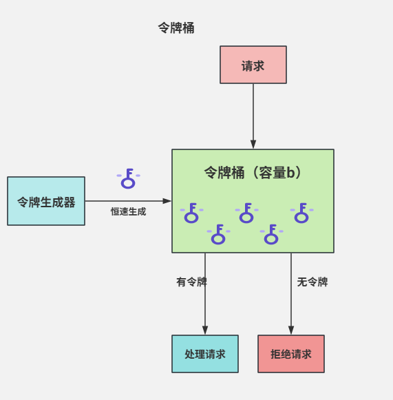
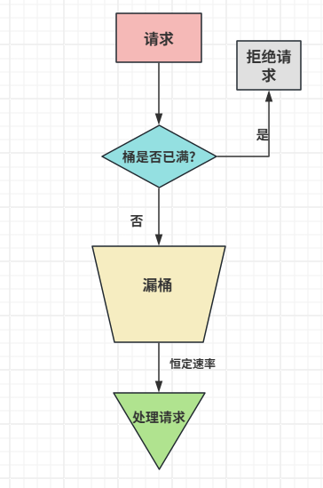
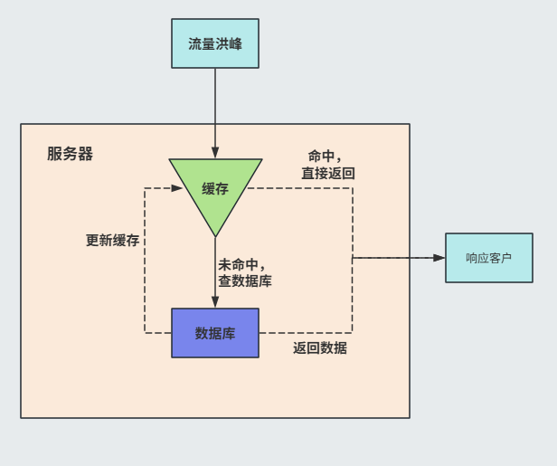
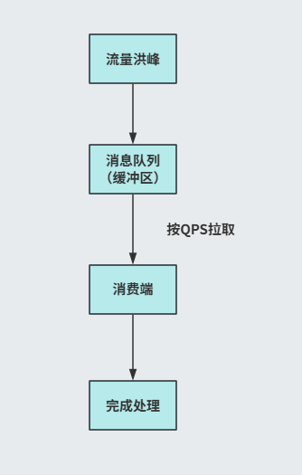
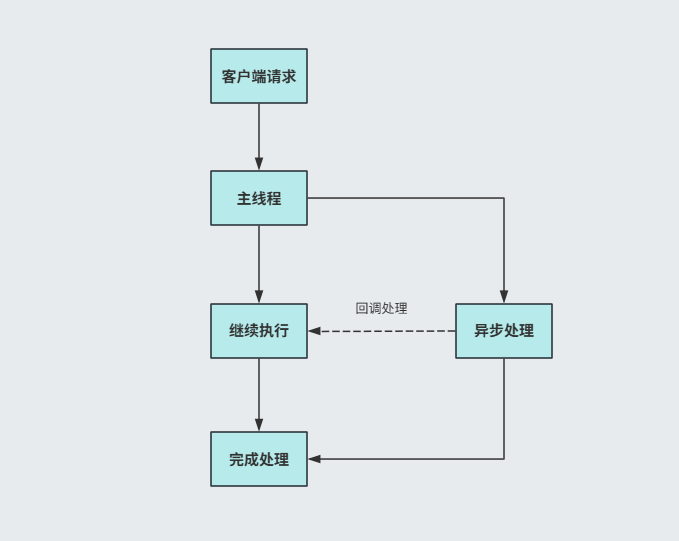

高并发系统中，秒杀活动，热点事件，这些瞬间访问流量对系统都是一种考验，稍不留意就会引发服务超时、宕机。

流量削峰的目的就是通过技术手段把集中的流量**限流**，**缓冲**，**分散**，使得系统能够平稳的处理请求。

下面来说说常见的方案。

### 限流

在抢购活动中，大量用户同一个时间点连续点击购买按钮，如果每次点击都发送请求给后端，无疑会有大量的无效请求涌入，造成没有必有的资源浪费。

在流量入口做一些限制是一个很有用的策略。

**令牌桶**

令牌桶算是最为常见的一种限流算法。

核心可以理解为有一个桶，以固定速率往里面放令牌，请求来了要拿令牌，有令牌就处理，没有就拒绝或者等待



令牌桶限流有一个好处，系统会提前存储一定量的令牌，遇到一定程度的突发流量，请求速率大于令牌生成速率，只有令牌桶中的令牌还有，系统也可以正常处理。

目前频率高的令牌桶实现主要有 Guava RateLimiter (适合单机模式，仅在JVM ) 和 Redission RRateLimiter（分布式，微服务集群、跨实例限流）。

```java
public class RedissonRateLimiterDemo {
    public static void main(String[] args) {
        // 1. 初始化 Redisson 客户端
        Config config = new Config();
        config.useSingleServer().setAddress("redis://127.0.0.1:6379");
        Redisson redisson = (Redisson) Redisson.create(config);

        // 2. 获取并配置限流器实例（名称唯一，用于标识限流器）
        RRateLimiter rateLimiter = redisson.getRateLimiter("orderRateLimiter");
        // 配置：全局限流，每秒生成 5 个令牌，桶容量 10
        // 参数说明：
        // - rateType：限流类型（OVERALL 全局限流，PER_CLIENT 每个客户端限流）
        // - rate：速率（单位时间内生成的令牌数）
        // - rateInterval：时间间隔
        // - rateIntervalUnit：时间间隔单位
        rateLimiter.trySetRate(RateType.OVERALL, 5, 1, RateIntervalUnit.SECONDS);

        // 3. 模拟请求
        for (int i = 0; i < 20; i++) {
            new Thread(() -> {
                boolean acquired = rateLimiter.tryAcquire(1);
                if (acquired) {
                    System.out.println(Thread.currentThread().getName() + "：获取令牌成功，处理请求");
                } else {
                    System.out.println(Thread.currentThread().getName() + "：获取令牌失败，拒绝请求");
                }
            }, "Thread-" + i).start();
        }

        // 4. 关闭客户端
        redisson.shutdown();
    }
}
```

```java
import com.google.common.util.concurrent.RateLimiter;

public class RateLimiterDemo {
    public static void main(String[] args) {
        // 创建限流器：每秒生成 5 个令牌（桶容量默认为 10）
        RateLimiter rateLimiter = RateLimiter.create(5);

        // 模拟 10 次请求
        for (int i = 0; i < 10; i++) {
            // 阻塞获取 1 个令牌，返回等待时间
            double waitTime = rateLimiter.acquire();
            System.out.println("请求 " + (i + 1) + "：等待时间 = " + waitTime + " 秒，处理请求");
        }
    }
}

```


**漏桶**

漏桶也是一种比较常见的限流算法。

漏桶算法的模型可类比为一个底部有小孔的桶，将请求比作 “水”，请求进来都会先存放在桶里。桶满后水（请求）就溢出（拒绝）。



请求入桶，桶未满加入，桶满溢出。以固定速率处理请求，严格控制漏出速率，保护下游系统。

和令牌桶最大的区别在于**平滑流出**，面对突发流量时，即使桶是空的（系统空闲），处理请求速度也不变化，资源利用率较低。


**Sentinel限流**

除了自定义限流外，也可以使用一些成熟的限流组件。例如阿里开源的Sentinel限流。使用也比较方便。
在微服务应用场景下，功能丰富，集成度也好。

```java
import com.alibaba.csp.sentinel.Entry;
import com.alibaba.csp.sentinel.SphU;
import com.alibaba.csp.sentinel.slots.block.BlockException;
import com.alibaba.csp.sentinel.slots.block.RuleConstant;
import com.alibaba.csp.sentinel.slots.block.flow.FlowRule;
import com.alibaba.csp.sentinel.slots.block.flow.FlowRuleManager;

import java.util.ArrayList;
import java.util.List;

public class SentinelExample {
    
    public static void initFlowRules() {
        List<FlowRule> rules = new ArrayList<>();
        
        FlowRule rule = new FlowRule();
        rule.setResource("createOrder");  // 资源名
        rule.setGrade(RuleConstant.FLOW_GRADE_QPS);  // 限流阈值类型
        rule.setCount(10);  // 阈值
        rule.setControlBehavior(RuleConstant.CONTROL_BEHAVIOR_WARM_UP);  // 控制行为
        rule.setWarmUpPeriodSec(10);  // 预热时间
        
        rules.add(rule);
        FlowRuleManager.loadRules(rules);
    }
    
    public void createOrder(Order order) {
        // 定义资源
        try (Entry entry = SphU.entry("createOrder")) {
            // 受保护的业务逻辑
            orderService.save(order);
        } catch (BlockException e) {
            // 被限流时的处理逻辑
            handleBlocked(order);
        }
    }
    
    // 使用注解方式
    @SentinelResource(
        value = "getUserInfo",
        blockHandler = "handleBlock",
        fallback = "fallback"
    )
    public User getUserInfo(Long userId) {
        return userService.findById(userId);
    }
    
    // 限流处理函数
    public User handleBlock(Long userId, BlockException ex) {
        return User.builder()
            .id(userId)
            .name("限流返回")
            .build();
    }
    
    // 异常处理函数
    public User fallback(Long userId, Throwable t) {
        return User.builder()
            .id(userId)
            .name("降级返回")
            .build();
    }
}

```

### 缓存

除了限流，缓存也是应对流量洪峰的一种有效手段。

在如秒杀、大促、热点事件时，大多数请求都是读请求，直接请求后端服务（数据库、业务接口），很大高绿会响应超时、服务雪崩。

缓存，**提前存储热点数据、就近响应请求**，就是一种很好的手段。



当请求进来时，会先在缓存查找，结果命中直接返回，未命中则去数据库查询，返回结果，并更新缓存以备后用。

通过缓存大幅度的削减流量，极大的减小了后端服务的压力。

缓存架构可以采用**CDN + 本地缓存 + Redi**的多级架构，实现缓存应用最大化。

### 消息队列

消息队列作为异步化、解耦、流量削峰的核心中间件，也是应对高并发流量的一种常用策略

消息队列将瞬时爆发的请求先写入消息队列（队列作为 “缓冲池”），后端服务按自身处理能力（QPS）从队列拉取消息处理，实现削峰填谷和服务解耦。



通过**缓冲队列暂存请求，后端服务异步消费**的逻辑，将**突发流量**转化为**平滑流量**，以免对后端服务造成巨大压力。

常见的消息队列有RabbitMQ，RocketMQ，Kafka，可以根据流量规模，可靠性要求，业务场景选择。


### 异步处理

异步处理是一种常见的编程模式，用于处理可能耗时的操作（如I/O操作、网络请求等），而不会阻塞主线程。

常见方式有CompletableFuture，ExecutorService线程池，反应式编程（如Reactor、RxJava）等等。



使用CompletableFuture编程

```java
import java.util.concurrent.CompletableFuture;

public class CompletableFutureExample {
    public static void main(String[] args) {
        // 创建异步任务
        CompletableFuture<String> future = CompletableFuture.supplyAsync(() -> {
            // 模拟耗时操作
            try { Thread.sleep(1000); } catch (InterruptedException e) {}
            return "Hello";
        }, executor); // 可指定线程池

        // 异步回调
        future.thenAccept(result -> {
            System.out.println("结果: " + result);
        });

        // 链式调用
        CompletableFuture<Void> chain = CompletableFuture
            .supplyAsync(() -> "Hello")
            .thenApplyAsync(s -> s + " World") // 异步转换
            .thenAcceptAsync(System.out::println) // 异步消费
            .exceptionally(ex -> {
                System.err.println("异常: " + ex.getMessage());
                return null;
            });
        
        // 主线程继续执行
        System.out.println("主线程继续执行");

        // 等待异步任务完成（防止主线程过早退出）
        try {
            Thread.sleep(2000);
        } catch (InterruptedException e) {
            e.printStackTrace();
        }
    }
}
```

使用反应式编程Reactor
 
```java
import reactor.core.publisher.Mono;

public class ReactorExample {
    public static void main(String[] args) {
        Mono.fromCallable(() -> {
            Thread.sleep(1000);
            return "Hello Reactor";
        })
        .subscribeOn(Schedulers.elastic()) // 在弹性线程池中执行
        .subscribe(result -> System.out.println(result));

        System.out.println("主线程继续执行");
        // 等待异步任务完成
        try {
            Thread.sleep(2000);
        } catch (InterruptedException e) {
            e.printStackTrace();
        }
    }
}
```


### 写在最后

上面这几种限流方式常常是组合使用，多层次限流，保护系统不被过载请求冲垮。
最后如果这些层面上的还不能解决，那就要考虑动态扩容了。这就是另一个层面的问题了，后面有机会再说。