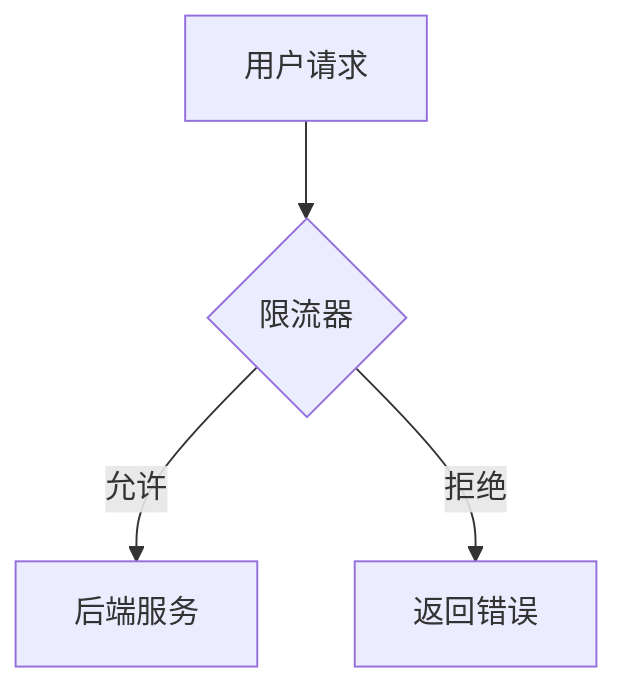
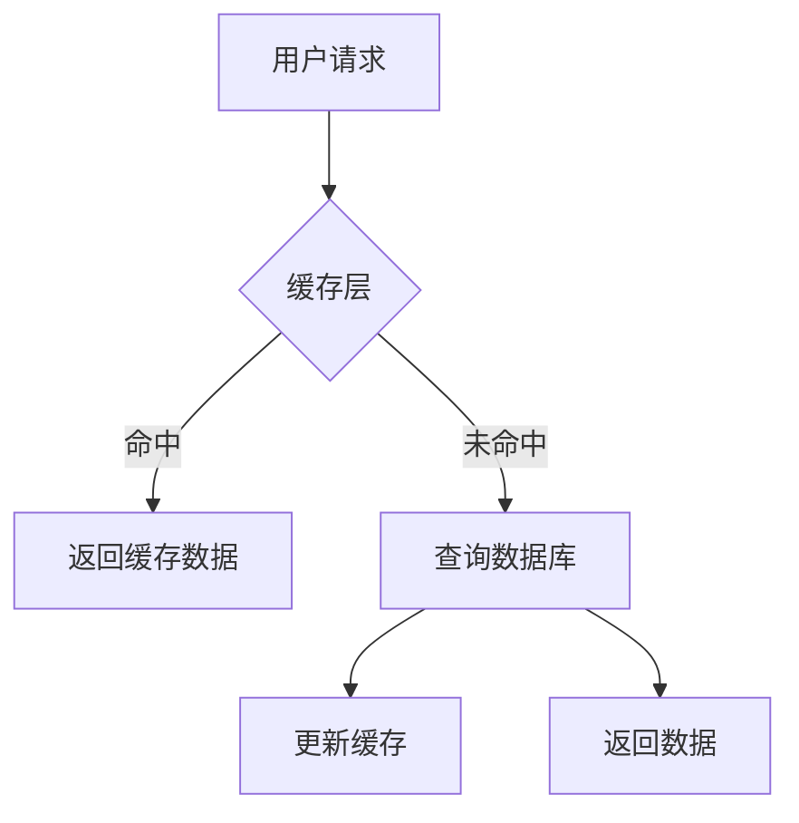
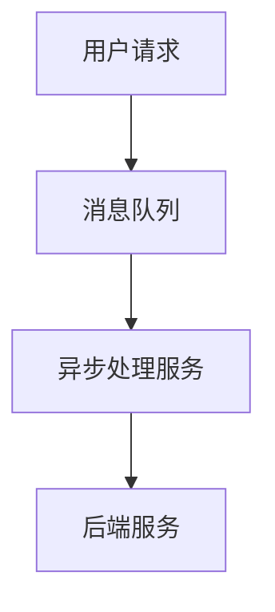
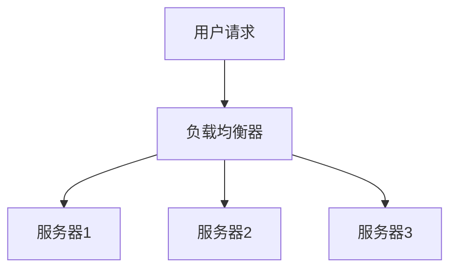
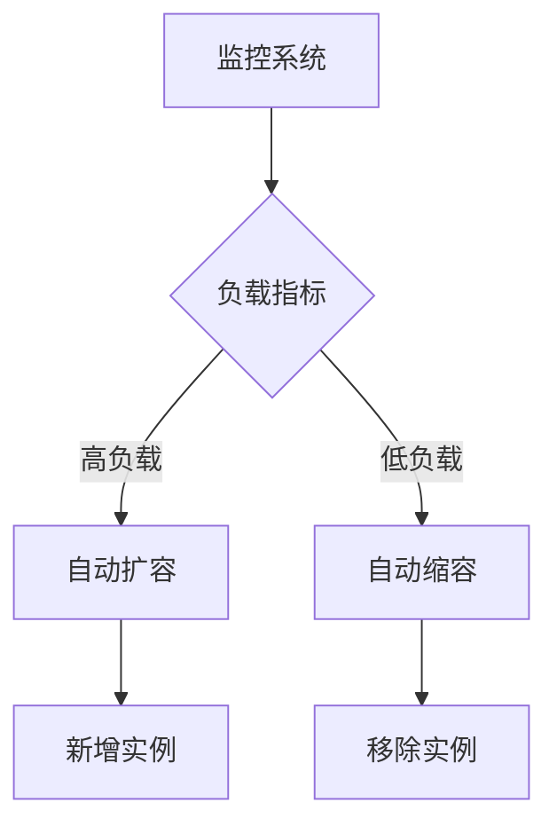
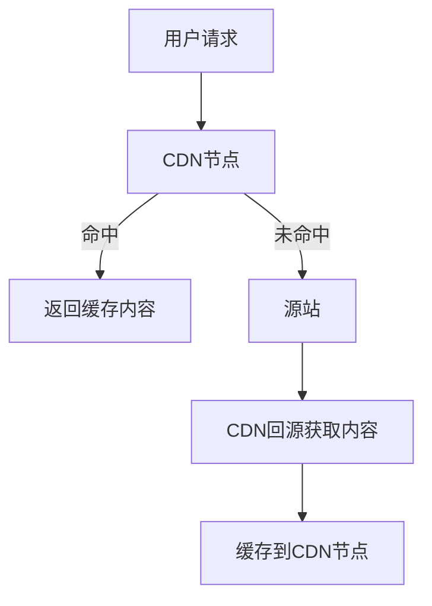

# 流量削峰架构图

## 限流方案架构图

```mermaid
graph TD
    A[用户请求] --> B{限流器}
    B -->|允许| C[后端服务]
    B -->|拒绝| D[返回错误]
```

## 缓存方案架构图

```mermaid
graph TD
    A[用户请求] --> B{缓存层}
    B -->|命中| C[返回缓存数据]
    B -->|未命中| D[查询数据库]
    D --> E[更新缓存]
    D --> F[返回数据]
```

## 消息队列方案架构图

```mermaid
graph TD
    A[用户请求] --> B[消息队列]
    B --> C[异步处理服务]
    C --> D[后端服务]
```

## 负载均衡方案架构图

```mermaid
graph TD
    A[用户请求] --> B[负载均衡器]
    B --> C[服务器1]
    B --> D[服务器2]
    B --> E[服务器3]
```

## 弹性伸缩方案架构图

```mermaid
graph TD
    A[监控系统] --> B{负载指标}
    B -->|高负载| C[自动扩容]
    B -->|低负载| D[自动缩容]
    C --> E[新增实例]
    D --> F[移除实例]
```

## CDN方案架构图

```mermaid
graph TD
    A[用户请求] --> B[CDN节点]
    B -->|命中| C[返回缓存内容]
    B -->|未命中| D[源站]
    D --> E[CDN回源获取内容]
    E --> F[缓存到CDN节点]
```