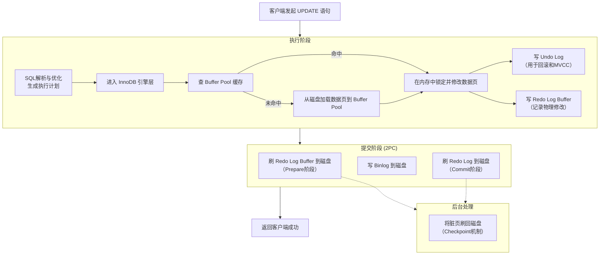

## 记录一次InnoDB update的事务执行过程

最近整理了MySQL索引，事务，MVCC，日志系统等相关知识，想着具体结合某个操作的执行过程来串串。
今天刚好碰见个update操作，就以这个操作为例，记录一下InnoDB的事务执行过程。
这个过程涉及到了多个核心组件，包括Buffer Pool，Undo Log，Redo Log，binlog，以及MVCC等。

为了直观理解，可以将整个流程分为几个核心阶段：

### 1. 事务开始

显示执行BEGIN/START TRANSACTION，开启一个事务。
InnoDB会为事务分配一个事务ID（后续就会记录在数据表的隐藏列-DB_TRX_ID 中），初始化事务上下文。事务ID是全局唯一的，单调递增的。

### 2. 定位并加载数据页

InnoDB根据where条件，通过**索引**定位目标行，加载数据页到Buffer Pool(缓冲池)。
检查Buffer Pool中是否已经存在该数据页，如果存在，则直接返回数据页；如果不存在，则从磁盘读取数据页到Buffer Pool。
 
### 3. 加行级锁

InnoDB 

